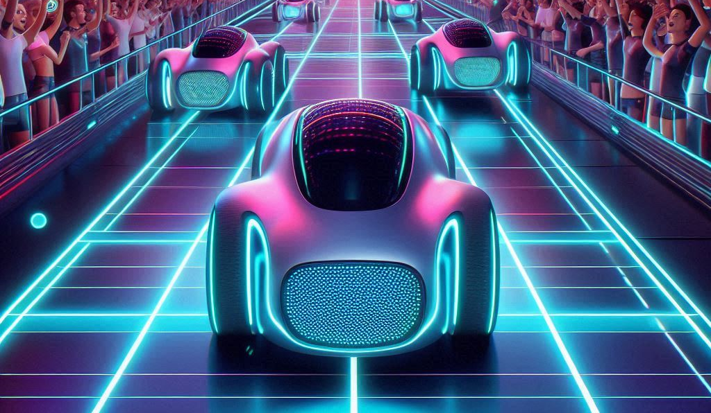

# Car Racing Simulation



This project is a car racing simulation that features both human-controlled and AI-driven cars. The simulation includes a mini-map, statistics for each car, and a collision handling system. The AI cars can learn from previous experiences, making the simulation more interesting and challenging.

## Features

- **Car Generation**: Generate multiple cars, both human-controlled and AI-driven.
- **Collision Detection**: Handle collisions with road borders effectively.
- **Mini-map**: A mini-map displays the position and orientation of the cars.
- **Statistics Panel**: Displays statistics for each car, including progress and finish times.
- **AI Learning**: The AI cars can learn from the best-performing car's brain, allowing for improved performance in subsequent races.
- **Responsive Design**: The canvas adjusts based on window size.

## Getting Started

### Prerequisites

- A modern web browser (Chrome, Firefox, etc.)
- Basic understanding of HTML, CSS, and JavaScript

### Installation

1. Clone the repository:
   ```bash
   git clone https://github.com/aaryan2720/neural-network-car-race
   cd car-racing-simulation